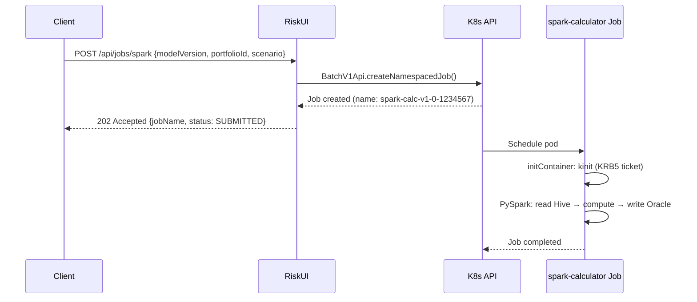

# risk-ui

REST API gateway for launching risk model computations. Calls `risk-engine` directly
for small portfolios and creates Kubernetes Jobs for large Spark-based calculations.
Includes a browser UI at `/` for dispatching jobs interactively.

**Kubernetes workload: `Deployment`**

## Stack

- Java 21, Spring Boot 3.3
- Kubernetes Java client (io.kubernetes:client-java)
- SpringDoc OpenAPI (Swagger UI)
- Micrometer + Prometheus metrics

## Structure

```text
src/main/java/com/example/riskui/
├── RiskUiApplication.java               — Spring Boot entry point
├── config/AppConfig.java                — RestClient bean for risk-engine
├── controller/RiskController.java       — REST endpoints
├── model/JobRequest.java                — Job launch parameters (record)
├── model/JobStatus.java                 — Job launch response (record)
├── model/JobHistoryEntry.java           — History entry (record)
├── service/JobHistoryService.java       — In-memory job history (last 50, resets on restart)
├── service/KubernetesJobService.java    — Kubernetes API: create Batch/v1 Jobs
└── service/RiskEngineClient.java        — HTTP client for risk-engine
```

## Endpoints

| Method | Path | Description |
|--------|------|-------------|
| GET | `/` | Browser UI — dispatch jobs interactively |
| POST | `/api/calculate` | Direct call to risk-engine (synchronous) |
| POST | `/api/jobs/spark` | Launch spark-calculator Kubernetes Job (async) |
| POST | `/api/jobs/async` | Publish job request to Kafka (event-driven) |
| GET | `/api/jobs/history` | Last 50 dispatched jobs (in-memory) |
| GET | `/api/jobs/{name}/status` | Get Job status by name |
| GET | `/actuator/health` | Health check |
| GET | `/actuator/prometheus` | Prometheus metrics |
| GET | `/swagger-ui.html` | Interactive API docs |

## How Job launching works



The caller receives the Job name immediately and can poll `/api/jobs/{name}/status`
or use `kubectl get job <name>` to check completion.

## Kubernetes RBAC

This service needs permission to create Jobs in its namespace.
The Role and RoleBinding are managed by the Helm chart (`006_gitops/helm/risk-ui/templates/rbac.yaml`)
and are created only when `kubernetes.enabled=true` in values.

```yaml
rules:
  - apiGroups: ["batch"]
    resources: ["jobs"]
    verbs: ["create", "get", "list", "watch"]
```

The ServiceAccount is automatically mounted into the pod. No explicit credentials are needed.

## Configuration

| Variable | Description | Default |
|----------|-------------|---------|
| `RISK_ENGINE_URL` | risk-engine base URL | `http://risk-engine:8081` |
| `KUBERNETES_ENABLED` | Enable K8s Job launching | `true` |
| `KUBERNETES_NAMESPACE` | Target namespace for Jobs | `hadoop-demo-dev` |
| `SPARK_CALCULATOR_IMAGE` | Docker image for the Job | from Nexus |
| `PORT` | HTTP port | `8080` |
