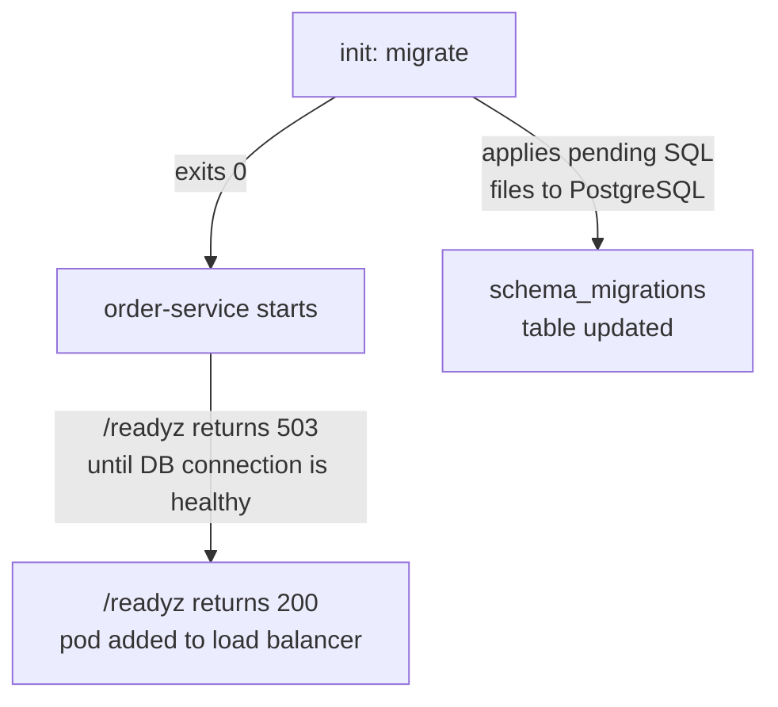

# order-service

Order management service. Implements create/read order business logic, persists data
to PostgreSQL, and publishes domain events to RabbitMQ.

**Kubernetes workload: `Deployment`**

Deployment is used because:

- the service is stateless — state lives in PostgreSQL, not in the process
- horizontal scaling via HPA is needed
- replica startup order does not matter

See the workload comparison table: [README.md — When to use which workload](../README.md#when-to-use-which-kubernetes-workload)

## Stack

- Python 3.12
- FastAPI
- SQLAlchemy + asyncpg (PostgreSQL, async)
- aio-pika (RabbitMQ)
- prometheus-client

## Structure

- [src/main.py](src/main.py) — FastAPI app, lifespan (connects publisher, checks both deps in /readyz)
- [src/config.py](src/config.py) — env var mapping: secrets vs ConfigMap fields
- [src/models.py](src/models.py) — SQLAlchemy ORM: Order model, UUID primary key rationale
- [src/repository.py](src/repository.py) — async engine, sessionmaker, check_db_connection for /readyz
- [src/publisher.py](src/publisher.py) — RabbitMQ TOPIC exchange, PERSISTENT delivery, connect_robust
- [src/metrics.py](src/metrics.py) — Prometheus metrics
- [tests/test_main.py](tests/test_main.py) — endpoint tests with mocked repository and publisher
- [Dockerfile](Dockerfile) — multi-stage build, requirements.txt (no build backend), non-root user
- [requirements.txt](requirements.txt) — runtime dependencies
- [requirements-dev.txt](requirements-dev.txt) — dev/test dependencies

> **No pyproject.toml** — this service intentionally uses the classic `requirements.txt`
> approach. It represents the most common legacy project structure. Migration to a modern
> build backend starts by creating a `pyproject.toml` and pointing it at the existing
> `requirements.txt` content.

## Configuration

| Variable | Description | Source in K8s |
| --- | --- | --- |
| `DATABASE_URL` | PostgreSQL connection string | Secret |
| `RABBITMQ_URL` | RabbitMQ connection string | Secret |
| `ORDERS_EXCHANGE` | RabbitMQ exchange name | ConfigMap |
| `LOG_LEVEL` | Logging level | ConfigMap |
| `PORT` | Application port | ConfigMap |

## Endpoints

| Method | Path | Description |
| --- | --- | --- |
| `GET` | `/healthz` | Liveness probe |
| `GET` | `/readyz` | Readiness probe (checks DB and RabbitMQ) |
| `GET` | `/metrics` | Prometheus metrics |
| `POST` | `/orders` | Create order |
| `GET` | `/orders/{id}` | Get order by ID |

## Database migrations (init container alternative)

This service includes an alternative migration approach using
[golang-migrate](https://github.com/golang-migrate/migrate) *(external)* and a Kubernetes
init container instead of the separate `004_db-migrator` Job.

SQL migration files: [migrations/](migrations/)

```text
migrations/
├── 000001_initial_schema.up.sql    # applied by `migrate up`
└── 000001_initial_schema.down.sql  # applied by `migrate down` (dev/test only)
```

A separate image ([Dockerfile.migrate](Dockerfile.migrate)) packages the golang-migrate
binary and the SQL files. It is built and pushed alongside the application image in CI.

When `migrations.enabled: true` in values, Kubernetes runs the migration container
**before** starting the application:



If the migration fails → pod restarts → main container never starts → broken schema
cannot reach a running application.

Comparison with `004_db-migrator` (Job + ArgoCD PreSync hook):

| | Init container | Job (PreSync hook) |
| --- | --- | --- |
| Runs | on every pod start | once per ArgoCD sync |
| Coordination | none needed | ArgoCD sync wave ordering |
| Failure handling | pod restarts automatically | Job retries per `backoffLimit` |
| Visibility | in pod events | in separate Job object |
| Best for | simple cases, single cluster | multi-service deploys, strict ordering |

See the annotated manifest:
[006_gitops/manifests/order-service/deployment.yaml](../006_gitops/manifests/order-service/deployment.yaml)

## Kubernetes resources

- Helm chart: [006_gitops/helm/order-service/](../006_gitops/helm/order-service/)
- Per-environment values: [values-dev.yaml](../006_gitops/helm/order-service/values-dev.yaml) / [values-staging.yaml](../006_gitops/helm/order-service/values-staging.yaml) / [values-prod.yaml](../006_gitops/helm/order-service/values-prod.yaml)
- Annotated manifests: [006_gitops/manifests/order-service/](../006_gitops/manifests/order-service/)
- ArgoCD Applications: [dev](../006_gitops/argocd/applications/dev/order-service.yaml) / [staging](../006_gitops/argocd/applications/staging/order-service.yaml) / [prod](../006_gitops/argocd/applications/order-service.yaml)
