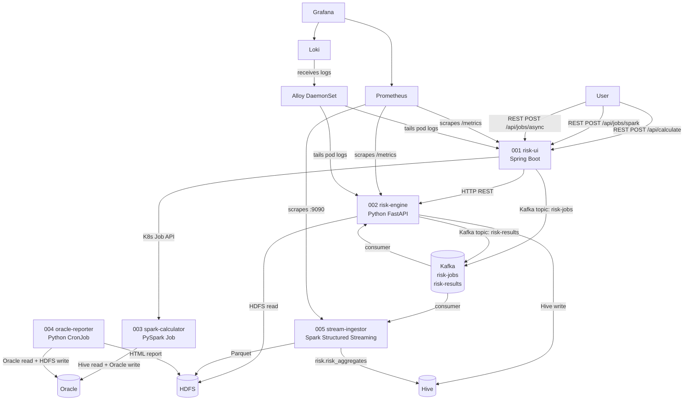
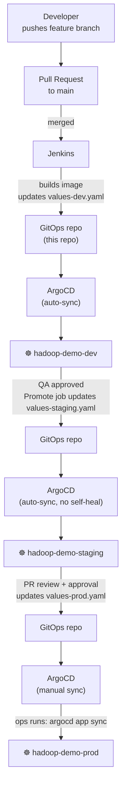

# 006_gitops — Hadoop Demo GitOps

ArgoCD-based GitOps for the hadoop-demo services: Helm charts, environment overlays,
Kerberos manifests, RBAC, and observability stack (Prometheus + Loki + Alloy + Grafana).

## Architecture



## Repository layout

```text
006_gitops/
├── helm/
│   ├── argocd/           — ArgoCD itself (wrapper chart, depends on argo/argo-cd)
│   │   ├── Chart.yaml
│   │   ├── Chart.lock
│   │   └── values.yaml   # resource limits + Traefik IngressRouteTCP (extraObjects)
│   ├── argocd-apps/      — AppProject + Applications for all services (one Helm release)
│   │   ├── Chart.yaml
│   │   ├── values.yaml   # repo URL, branch, destination namespace, per-app chart paths
│   │   └── templates/
│   │       ├── appproject.yaml    # AppProject "hadoop-demo" (destinations: namespace="*")
│   │       └── applications.yaml  # Applications generated via range loop (supports per-app namespace)
│   ├── kafka/            — Kafka broker (KRaft mode, no ZooKeeper)
│   │   ├── Chart.yaml
│   │   ├── values.yaml   # apache/kafka:3.9.0, emptyDir storage
│   │   └── values-dev.yaml
│   ├── monitoring/       — Observability stack (wrapper chart)
│   │   ├── Chart.yaml    # depends on: kube-prometheus-stack + loki + alloy
│   │   ├── Chart.lock
│   │   ├── values.yaml   # merged values for all three sub-charts
│   │   ├── values-dev.yaml  # smaller storage (local-path), alertmanager disabled
│   │   └── templates/
│   │       ├── service-monitors.yaml    # ServiceMonitor for risk-ui, risk-engine, stream-ingestor
│   │       ├── prometheus-rules.yaml    # PrometheusRule alerts (risk-engine, stream-ingestor, risk-ui)
│   │       └── grafana-dashboard.yaml   # ConfigMap: "Hadoop Demo — Overview" dashboard
│   ├── risk-ui/          — Deployment + Service + IngressRoute + RBAC
│   ├── risk-engine/      — Deployment + Hive PreSync migration + ServiceMonitor
│   ├── spark-calculator/ — Job (manualSelector=true for ArgoCD Replace compatibility)
│   ├── oracle-reporter/  — CronJob + Oracle PreSync migration (Alembic)
│   └── stream-ingestor/  — Deployment + Service + ServiceMonitor
│
│   Each application chart ships two values files:
│     values.yaml     — production defaults (Kerberos, Hadoop, ServiceMonitor enabled)
│     values-dev.yaml — dev/K3s overrides (local registry, per-subsystem mock flags, prod features disabled)
│
│   Mock flags (risk-engine, stream-ingestor):
│     MOCK_MODE        — master switch, default for all three flags below
│     KAFKA_MOCK_MODE  — false in dev (real Kafka broker)
│     HDFS_MOCK_MODE   — true in dev (in-memory stubs, no hdfs3 needed)
│     HIVE_MOCK_MODE   — true in dev (in-memory stubs, no PyHive needed)
│
└── manifests/            — rendered-output examples (for reference; managed by ArgoCD via helm/)
    ├── registry/
    │   └── registry.yaml            # in-cluster Docker registry (NodePort 30500)
    ├── hadoop-config/
    │   └── configmap.yaml           # core-site, hdfs-site, hive-site, krb5.conf
    ├── krb5/
    │   ├── krb5-configmap.yaml      # /etc/krb5.conf mounted in all pods
    │   └── README.md                # keytab secret creation guide
    ├── vault/
    │   ├── cluster-secret-store.yaml  # ESO ClusterSecretStore → Vault
    │   ├── external-secrets.yaml      # ExternalSecret CRDs (keytabs + Oracle password)
    │   └── README.md                  # Vault setup and policy guide
    ├── rbac/
    │   └── risk-ui-role.yaml          # example rendered output of helm/risk-ui (Role + RoleBinding)
    ├── kafka/
    │   └── kafka.yaml                 # example rendered output of helm/kafka
    └── monitoring/
        ├── kube-prometheus-values.yaml  # reference values (now in helm/monitoring/values.yaml)
        ├── loki-values.yaml             # reference values (now in helm/monitoring/values.yaml)
        ├── alloy-values.yaml            # reference values (now in helm/monitoring/values.yaml)
        ├── service-monitors.yaml        # example rendered output of helm/monitoring/templates/
        ├── prometheus-rules.yaml        # example rendered output of helm/monitoring/templates/
        └── grafana-dashboard-configmap.yaml  # example rendered output of helm/monitoring/templates/
```

## CI/CD flow



## Kafka topics

| Topic | Producer | Consumer | Format |
|-------|----------|----------|--------|
| `risk-jobs` | risk-ui (`/api/jobs/async`) | risk-engine (daemon thread) | JSON: JobRequest |
| `risk-results` | risk-engine (after VaR calc) | stream-ingestor (Spark Streaming) | JSON: RiskResult |

## Spark mode per environment

| Environment | Spark mode   | Values overlay              | Reason                              |
|-------------|--------------|----------------------------|-------------------------------------|
| dev         | `submit`     | values-spark-submit.yaml   | Fast iterations, no cluster needed  |
| staging     | `operator`   | values-spark-operator.yaml | Validates CRD workflow pre-prod     |
| prod        | `yarn`       | values-spark-yarn.yaml     | External YARN cluster, max resources|

## Kerberos patterns used

### Sidecar (risk-engine Deployment)

```text
Pod
├── krb5-renewer (sidecar)   — kinit -R every 8h from keytab
│   └── writes TGT → /tmp/krb5/tgt  (emptyDir)
└── risk-engine (main)       — KRB5CCNAME=/tmp/krb5/tgt
```

### Init container (spark-calculator Job, oracle-reporter CronJob, stream-ingestor Deployment)

```text
Pod
├── krb5-init (initContainer) — kinit -kt keytab principal → writes TGT
└── main-container            — KRB5CCNAME=/tmp/krb5/tgt
```

## Secret management

Keytabs and database passwords must never be stored in Git.
All environments use External Secrets Operator (ESO) to sync secrets from HashiCorp Vault.
Vault is the single authoritative secret store across dev, staging, and prod —
only the namespace and sync policy differ.

### External Secrets Operator + Vault

```text
Vault KV (secrets/hadoop-demo/*)
  └─► ExternalSecret (ESO CRD)
        └─► Kubernetes Secret   ← mounted into pod as file or env var
```

ESO polls Vault every `1h`. When a keytab is rotated in Vault, ESO refreshes
the Kubernetes Secret — the sidecar picks it up on the next `kinit -R` cycle,
the init-container pattern picks it up on the next Job/pod restart.

Manifests: [`manifests/vault/`](manifests/vault/)

- `cluster-secret-store.yaml` — ClusterSecretStore pointing to Vault via Kubernetes auth
- `external-secrets.yaml` — one ExternalSecret per service (4 keytabs + Oracle password)

Vault secret layout:

```text
secrets/hadoop-demo/
  risk-engine/       keytab (base64)
  spark-calculator/  keytab (base64)
  oracle-reporter/   keytab (base64), oracle-password
  stream-ingestor/   keytab (base64)
```

See [`manifests/vault/README.md`](manifests/vault/README.md) for Vault policy,
Kubernetes auth setup, and how to load keytabs into Vault.

---

## Observability

### Metrics (Prometheus + Grafana)

| Service | Endpoint | Key metrics |
|---------|----------|-------------|
| risk-ui | `/actuator/prometheus` | `riskui_kafka_jobs_total`, `riskui_calculate_requests_total` |
| risk-engine | `/metrics` | `risk_engine_calculations_total`, `risk_engine_calculation_duration_seconds`, `risk_engine_kafka_consumer_lag` |
| stream-ingestor | `:9090/metrics` | `stream_ingestor_records_processed_total`, `stream_ingestor_batch_duration_seconds`, `stream_ingestor_last_batch_timestamp_seconds` |

#### Grafana dashboard

The **"Hadoop Demo — Overview"** dashboard is pre-provisioned — no manual import needed.

How it works:

```text
grafana-dashboard-configmap.yaml   (ConfigMap, label: grafana_dashboard=1)
  └─► kube-prometheus-stack picks it up via dashboardsConfigMaps
        └─► Grafana mounts JSON into /var/lib/grafana/dashboards/hadoop-demo/
              └─► dashboardproviders.yaml tells Grafana to load that folder on startup
```

The ConfigMap label and folder path are configured in
[`manifests/monitoring/kube-prometheus-values.yaml`](manifests/monitoring/kube-prometheus-values.yaml)
(`grafana.dashboardProviders` + `grafana.dashboardsConfigMaps`).

Dashboard panels:

| Panel | Metric / query |
|-------|---------------|
| Calculation rate | `rate(risk_engine_calculations_total[5m])` |
| Error rate | `rate(risk_engine_calculation_errors_total[5m])` |
| Kafka consumer lag | `risk_engine_kafka_consumer_lag` |
| Active calculations | `risk_engine_active_calculations` |
| Records processed | `rate(stream_ingestor_records_processed_total[5m])` |
| Batch duration (p95) | `histogram_quantile(0.95, stream_ingestor_batch_duration_seconds_bucket)` |
| Kafka publish failures | `rate(riskui_kafka_publish_failed_total[5m])` |
| REST request rate | `rate(riskui_calculate_requests_total[5m])` |
| Async job requests | `rate(riskui_kafka_jobs_total[5m])` |

Access Grafana (port-forward):

```bash
kubectl port-forward svc/kube-prometheus-grafana 3000:80 -n monitoring
# open http://localhost:3000  (admin / see kube-prometheus-values.yaml)
```

### Logs (Loki + Alloy)

All services emit structured JSON logs to stdout. Alloy (DaemonSet) tails pod logs and
ships to Loki with Kubernetes metadata labels (`namespace`, `app`, `pod`, `container`).

Useful LogQL queries:

```logql
# All risk-engine errors
{app="risk-engine"} |= "ERROR"

# Kafka consumer lag warnings
{app="risk-engine"} | json | level = "WARNING" | line_format "{{.msg}}"

# Stream-ingestor micro-batch durations
{app="stream-ingestor"} | json | msg =~ "Micro-batch.*done"
```

### Alerts (PrometheusRule)

| Alert | Condition | Severity |
|-------|-----------|----------|
| `RiskEngineNoCalculations` | No successful calcs in 10m | warning |
| `RiskEngineHighErrorRate` | Error rate > 5% | critical |
| `RiskEngineKafkaLagHigh` | Consumer lag > 100 | warning |
| `StreamIngestorStaleBatch` | No batch in 5m | warning |
| `StreamIngestorBatchFailures` | Any batch failure | critical |
| `RiskUIKafkaPublishFailures` | Any Kafka publish failure | warning |

## Migrations

| Service | Engine | Direction | Rollback |
|---------|--------|-----------|---------|
| risk-engine | beeline (.hql) | forward-only (DDL) | No |
| stream-ingestor | beeline (.hql) — migration 000003 | forward-only | No |
| oracle-reporter | Alembic | up / down | Yes |

## Bootstrap (first deploy to a new cluster)

All cluster components are managed via Helm — no raw `kubectl apply` for infrastructure.

```bash
# 1. Add Helm repositories
helm repo add argo https://argoproj.github.io/argo-helm
helm repo update

# 2. Install ArgoCD
cd 006_gitops/helm/argocd
helm dependency update
helm upgrade --install argocd . -n argocd --create-namespace

# 3. Install AppProject + Applications
#    ArgoCD will start syncing all services from GitHub automatically
#    (kafka, monitoring, risk-engine, risk-ui, stream-ingestor, spark-calculator, oracle-reporter)
cd ../argocd-apps
helm upgrade --install hadoop-demo . -n argocd

# 4. (Production only) Install External Secrets Operator
helm repo add external-secrets https://charts.external-secrets.io
helm upgrade --install external-secrets external-secrets/external-secrets \
  -n external-secrets --create-namespace

# 5. (Production only) Load keytabs into Vault
vault kv put secrets/hadoop-demo/risk-engine \
  keytab="$(base64 -w0 /path/to/risk-engine.keytab)"
vault kv put secrets/hadoop-demo/spark-calculator \
  keytab="$(base64 -w0 /path/to/spark-calculator.keytab)"
vault kv put secrets/hadoop-demo/oracle-reporter \
  keytab="$(base64 -w0 /path/to/oracle-reporter.keytab)" \
  oracle-password="<oracle_password>"
vault kv put secrets/hadoop-demo/stream-ingestor \
  keytab="$(base64 -w0 /path/to/stream-ingestor.keytab)"

# 6. Apply Hadoop config per namespace
for ns in hadoop-demo-dev hadoop-demo-staging hadoop-demo-prod; do
  kubectl apply -f manifests/hadoop-config/ -n "$ns"
done
```

ArgoCD syncs applications automatically (`automated: prune + selfHeal`).
To switch environments, override `source.targetRevision` and `destination.namespace`
in `helm/argocd-apps/values.yaml` and run `helm upgrade`.

### Local K3s demo cluster

For a single-node K3s cluster without Kerberos, Hadoop, or Vault.
Each chart ships a `values-dev.yaml` with local registry references and all production-only
features disabled (`krb5`, `hadoop`, `serviceMonitor`, `migrate`).

Mock behaviour is controlled per-subsystem via three env vars (all fall back to `MOCK_MODE`
when not set explicitly):

| Env var | dev default | Purpose |
|---------|-------------|---------|
| `KAFKA_MOCK_MODE` | `false` | Use real Kafka broker |
| `HDFS_MOCK_MODE` | `true` | Replace HDFS reads/writes with in-memory stubs |
| `HIVE_MOCK_MODE` | `true` | Replace Hive inserts with in-memory stubs |

`docker-compose.yaml` keeps `MOCK_MODE=true` (no per-subsystem vars) → all three backends
are mocked, so no Kafka/Hadoop installation is needed for local development.
ArgoCD is configured to use `values-dev.yaml` via `helm/argocd-apps/values.yaml`.

```bash
# Deploy in-cluster Docker registry
kubectl apply -f manifests/registry/registry.yaml

# Push local images (built via make build in repo root)
docker tag risk-engine:latest <registry-ip>:30500/risk-engine:latest
docker push <registry-ip>:30500/risk-engine:latest
# ... repeat for each service

# Install ArgoCD
cd 006_gitops/helm/argocd && helm dependency update
helm upgrade --install argocd . -n argocd --create-namespace

# Install AppProject + Applications (ArgoCD uses values-dev.yaml automatically)
cd ../argocd-apps
helm upgrade --install hadoop-demo . -n argocd
```
