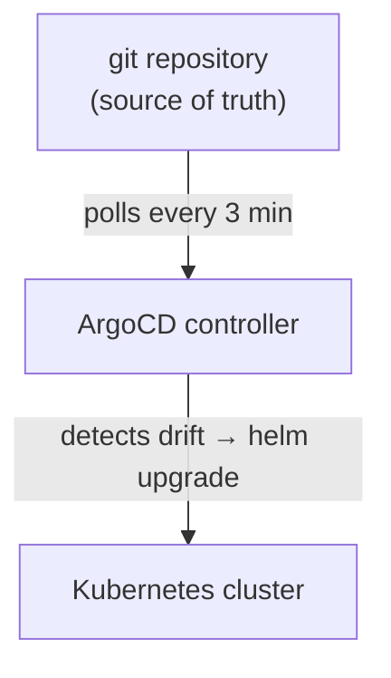
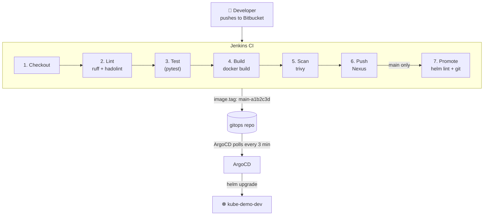

# gitops

GitOps repository: Helm charts and ArgoCD Application manifests for all services.
In a real project this is a separate repository maintained by the DevOps team.

---

## What is Helm

Helm is a package manager for Kubernetes. It solves the problem of managing many YAML files
that are almost identical but differ by environment, version, or replica count.

Without Helm you would maintain separate `deployment-dev.yaml`, `deployment-staging.yaml`,
`deployment-prod.yaml` — three files that are 95% identical. Any change (a new env var,
a probe tweak) must be applied to all three manually.

With Helm you have one **chart** (a directory of templates) and separate **values files**.
Templates contain Go template expressions:

```yaml
# templates/deployment.yaml
image: "{{ .Values.image.repository }}:{{ .Values.image.tag }}"
replicas: {{ .Values.replicaCount }}
```

Values files provide the actual values per environment:

```yaml
# values-dev.yaml        # values-prod.yaml
replicaCount: 1          replicaCount: 2
image:                   image:
  tag: "main-abc123"       tag: "1.4.2"
```

Helm renders the template + values into final Kubernetes YAML at deploy time:

```bash
helm upgrade --install api-gateway ./helm/api-gateway \
  -f values.yaml \
  -f values-prod.yaml    # overrides win
```

In this project each service has one chart (`helm/<service>/`) and three values files
(`values-dev.yaml`, `values-staging.yaml`, `values-prod.yaml`).

---

## What is ArgoCD

ArgoCD is a **GitOps controller** that runs inside Kubernetes. It continuously watches a
git repository and ensures that what is in the cluster matches what is in git.



**Why GitOps?** Without it, "who deployed what and when" is hard to answer — someone may
have run `kubectl apply` manually and left the cluster in an undocumented state.
With ArgoCD, every cluster change is a git commit. Git log is the deployment history.
Rolling back means reverting a commit.

**Key concepts:**

| Concept | What it is |
| --- | --- |
| `Application` | One ArgoCD object = one Helm release in one namespace. Points to a chart path and values files in git. |
| `AppProject` | A scope that limits which repos and namespaces an Application can use. Prevents one team's app from deploying to another team's namespace. |
| `syncPolicy` | `automated` = ArgoCD applies changes without human approval. `prune: true` = delete resources removed from git. `selfHeal: true` = revert manual `kubectl` changes. |
| sync wave | Ordering mechanism: ArgoCD deploys lower-wave Applications first and waits for them to become healthy before proceeding. |

**What ArgoCD does NOT do:** build images, run tests, or push to a registry. That is CI's job
(Jenkins). ArgoCD only reads git and applies to the cluster.

**Getting started:** see the step-by-step installation and bootstrap guide:
[argocd/BOOTSTRAP.md](argocd/BOOTSTRAP.md)

---

## Structure

```text
006_gitops/
├── helm/
│   ├── api-gateway/           # Helm chart — Deployment, Service, Ingress, HPA, ServiceMonitor
│   │   ├── values.yaml        # Base defaults (shared by all environments)
│   │   ├── values-dev.yaml    # Dev overrides: tag, replicas, log level, hostname
│   │   ├── values-staging.yaml
│   │   ├── values-prod.yaml
│   │   └── templates/
│   ├── order-service/         # same layout
│   ├── notification-service/
│   ├── db-migrator/
│   └── report-generator/
├── argocd/
│   ├── projects/              # ArgoCD AppProject — scopes repos and destination clusters
│   └── applications/
│       ├── dev/               # ArgoCD Applications pointing to kube-demo-dev namespace
│       ├── staging/           # ArgoCD Applications pointing to kube-demo-staging namespace
│       └── (root)             # ArgoCD Applications pointing to kube-demo-prod namespace
└── manifests/
    ├── README.md              # Explains how Helm renders manifests; field mapping
    ├── monitoring/            # PrometheusRule alerts + Grafana Loki datasource ConfigMap
    ├── vault/                 # ESO ClusterSecretStore + per-service ExternalSecrets
    ├── namespaces/            # ResourceQuota and LimitRange per environment
    ├── api-gateway/           # Annotated raw manifests for api-gateway
    ├── order-service/
    ├── notification-service/
    ├── db-migrator/
    └── report-generator/
```

---

## Environments

Three environments, each in its own Kubernetes namespace.

| Environment | Namespace | Sync | Purpose |
| --- | --- | --- | --- |
| dev | `kube-demo-dev` | Automatic | Every commit to `main` deploys here |
| staging | `kube-demo-staging` | Automatic | Promotion after dev validation |
| prod | `kube-demo-prod` | Automatic (or Manual) | Promotion after staging sign-off |

### What differs between environments

The base `values.yaml` defines production-safe defaults. Each `values-<env>.yaml`
overrides only what needs to change. Values are layered: ArgoCD applies them in order,
with later files overriding earlier ones.

```bash
# This is what ArgoCD effectively runs:
helm template api-gateway ./helm/api-gateway \
  -f values.yaml \
  -f values-dev.yaml      # dev-specific overrides win
```

Key differences across environments:

| Parameter | dev | staging | prod |
| --- | --- | --- | --- |
| `image.tag` | `main-<sha>` (auto) | promoted tag | promoted tag |
| `replicaCount` | 1 | 1 | 2 |
| `autoscaling.enabled` | false | false | true |
| `config.LOG_LEVEL` | DEBUG | INFO | INFO |
| `ingress.host` | `*.dev.kube-demo.internal` | `*.staging.kube-demo.internal` | `*.kube-demo.example.com` |
| `ingress.tls.enabled` | false | false | true |
| Resources (cpu/mem) | halved | production-like | full |
| Report schedule | every 30 min | daily | weekly |

**Secrets per environment** are NOT stored in git. Each namespace has its own
Kubernetes Secret objects created by the infrastructure team (or fetched from Vault).
The values files reference secret names, not values:

```yaml
# values.yaml — the secret name is the same in all environments
secrets: {}   # actual Secret object is created outside Helm, outside this repo
```

The Deployment reads env vars from the Secret via `envFrom`:

```yaml
envFrom:
  - secretRef:
      name: kube-demo-order-service-secret   # created by ops, not by Helm
```

**Secret management with External Secrets Operator (ESO):**

This project integrates with HashiCorp Vault via ESO to automate Secret lifecycle management.
ESO reads credentials from Vault and creates Kubernetes Secrets automatically —
no manual `kubectl create secret` and no secrets stored in CI/CD variables.

See the full setup guide: [manifests/vault/README.md](manifests/vault/README.md)

Relevant manifests:

- `manifests/vault/clusterSecretStore.yaml` — Vault connection configuration (cluster-scoped)
- `manifests/<service>/externalsecret.yaml` — per-service ExternalSecret resources

---

## CI/CD pipeline

### How a code change reaches production



**Quality gates in the pipeline:**

| Stage | Tool | Blocks deploy if... |
| --- | --- | --- |
| Lint | `ruff` | Python code violates style or has obvious errors |
| Lint | `hadolint` | Dockerfile has anti-patterns (missing `--no-cache-dir`, `apt` without cleanup, etc.) |
| Test | `pytest` | Any test fails |
| Scan | `trivy` | Image has HIGH/CRITICAL CVEs with an available fix |
| Promote | `helm lint` | Helm chart template has syntax errors |

**Jenkins never runs `kubectl` or `helm upgrade` against the cluster.**
It only builds images and commits to git. The cluster is exclusively managed by ArgoCD.
This separation means:

- Every cluster change has a git commit as its source of truth
- Rolling back = reverting a git commit
- Audit trail = git log

See the full annotated pipeline: [001_api-gateway/Jenkinsfile](../001_api-gateway/Jenkinsfile)
All other services follow the same pattern — only `SERVICE` variable changes.

### Promote to staging

After validating the build in dev, run the "Promote to Staging" Jenkins job
(a separate parameterized pipeline):

```bash
# Input: image tag from the dev values file
IMAGE_TAG=main-a1b2c3d

# What the promote job does:
yq e '.image.tag = "main-a1b2c3d"' -i helm/api-gateway/values-staging.yaml
git commit -am "ci(api-gateway): promote main-a1b2c3d to staging"
git push
# ArgoCD auto-syncs kube-demo-staging namespace
```

### Promote to prod

Production promotion is **intentionally not automated**. It requires a pull request:

1. Engineer creates a PR in the gitops repo changing `values-prod.yaml`:

   ```yaml
   image:
     tag: "main-a1b2c3d"   # change from previous release tag
   ```

2. A second engineer reviews and approves the PR.
3. PR is merged to `main`.
4. ArgoCD syncs `kube-demo-prod` (automated) — or the engineer clicks **Sync** in ArgoCD UI
   if the Application is configured with manual sync for an extra gate.

This gives a full audit trail: who promoted what, when, and who approved it.

---

## ArgoCD sync waves

Deployment order within each environment is controlled via annotations on each Application:

| Wave | What is deployed |
| --- | --- |
| `0` | db-migrator (runs as PreSync hook — before wave 0 resources start) |
| `1` | order-service, notification-service |
| `2` | api-gateway |
| `3` | report-generator (CronJob) |

ArgoCD applies resources in ascending wave order and waits for each wave to become
healthy before starting the next one. This ensures db migrations always run before
the application that uses the database.

---

## Monitoring

The observability stack is built on **kube-prometheus-stack** — a single Helm chart that
installs Prometheus Operator, Prometheus, Alertmanager, Grafana, kube-state-metrics, and
node-exporter in one shot.

### ServiceMonitor → Prometheus Operator → Prometheus

Each service Helm chart creates a `ServiceMonitor` CRD that declares which Service to scrape
and on which port. Prometheus Operator runs as a Kubernetes controller and watches for
`ServiceMonitor` resources across all namespaces. When a new `ServiceMonitor` appears, the
Operator automatically generates the corresponding Prometheus scrape job and reloads
configuration — no `prometheus.yml` editing, no Prometheus restart.

```text
service Helm chart → ServiceMonitor CRD → Prometheus Operator → Prometheus scrapes /metrics
```

### Deployment order

The `monitoring` ArgoCD Application uses **sync wave `-1`** so it is deployed before all
service Applications. This is required because `ServiceMonitor` CRDs must exist in the
cluster before ArgoCD applies service Helm charts — otherwise the Helm template rendering
fails with "unknown CRD" errors.

### References

- Full monitoring documentation: [manifests/monitoring/README.md](manifests/monitoring/README.md)
- Alert rules (PrometheusRule): [manifests/monitoring/prometheusrule.yaml](manifests/monitoring/prometheusrule.yaml)
- ArgoCD Applications: `argocd/applications/{dev,staging,prod}/monitoring.yaml`

### Logging (Grafana Loki + Alloy)

Log aggregation is provided by **Grafana Loki** with **Grafana Alloy** as the collector.

**Why Alloy instead of Promtail:**
Promtail reached End of Life on March 2, 2026 — Grafana officially ended all support.
Alloy is its successor, built on OpenTelemetry Collector. One Alloy DaemonSet replaces
Promtail (logs), Grafana Agent (metrics), and OTel Collector sidecars (traces) — reducing
operational complexity and node resource overhead.

**Why Loki instead of ELK/EFK:**
Loki indexes only log labels (metadata), not full log content. This makes it 10-50x
cheaper than Elasticsearch for the same log volume. Loki integrates natively into Grafana
as a datasource, so the same UI used for Prometheus metrics also serves log queries —
no separate Kibana instance required. Use OpenSearch if you need full-text search across
log content; Loki excels at label-based filtering and log-to-metric correlation.

**Log flow:**

```text
Pod stdout → Alloy DaemonSet → Loki → Grafana
```

Alloy reads `/var/log/pods/` on each node, attaches Kubernetes metadata labels
(`namespace`, `pod`, `app`, `container`), and pushes to Loki. Because these labels
match the labels Prometheus uses, you can correlate a metric spike with the relevant
log lines in Grafana Explore without any label translation.

Full documentation: [manifests/monitoring/logging-README.md](manifests/monitoring/logging-README.md)

---

## Infrastructure dependencies

Install before deploying application services:

```bash
# PostgreSQL
helm install postgresql bitnami/postgresql -f helm/infra/postgresql-values.yaml -n kube-demo-prod

# RabbitMQ
helm install rabbitmq bitnami/rabbitmq -f helm/infra/rabbitmq-values.yaml -n kube-demo-prod

# Prometheus + Grafana (kube-prometheus-stack)
helm install monitoring prometheus-community/kube-prometheus-stack -n monitoring
```

## Deploying a single service with Helm (manual / local)

```bash
# dev environment
helm upgrade --install api-gateway ./helm/api-gateway \
  -f ./helm/api-gateway/values.yaml \
  -f ./helm/api-gateway/values-dev.yaml \
  --namespace kube-demo-dev --create-namespace

# prod environment
helm upgrade --install api-gateway ./helm/api-gateway \
  -f ./helm/api-gateway/values.yaml \
  -f ./helm/api-gateway/values-prod.yaml \
  --namespace kube-demo-prod --create-namespace
```
