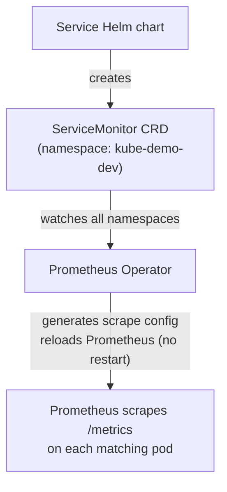

# Monitoring

Observability stack for the kube-demo project, built on
[kube-prometheus-stack](https://github.com/prometheus-community/helm-charts/tree/main/charts/kube-prometheus-stack).

---

## Components installed by kube-prometheus-stack

| Component | Role |
| --- | --- |
| Prometheus Operator | Watches for `ServiceMonitor` and `PrometheusRule` CRDs; configures Prometheus automatically |
| Prometheus | Scrapes `/metrics` endpoints, stores time-series data, evaluates alert rules |
| Alertmanager | Routes firing alerts to receivers (email, Slack, PagerDuty, etc.) |
| Grafana | Visualization dashboards; ships pre-built dashboards for Kubernetes and common exporters |
| kube-state-metrics | Exposes cluster-level metrics: pod phase, deployment replicas, job status, PVC usage |
| node-exporter | Exposes node-level metrics: CPU, memory, disk I/O, network |

---

## How ServiceMonitor → Prometheus works

Without Prometheus Operator you would edit `prometheus.yml` by hand every time a new
service is deployed. Prometheus Operator eliminates that by introducing two CRDs:



1. **ServiceMonitor** — created by each service's Helm chart (`templates/servicemonitor.yaml`).
   It declares *which* Service to scrape, *which port*, *which path*, and *how often*.
2. **Prometheus Operator** — a Kubernetes controller that watches for `ServiceMonitor`
   resources cluster-wide (or within selected namespaces).
3. **Automatic config reload** — when a new `ServiceMonitor` appears, the Operator generates
   the corresponding scrape job and reloads Prometheus configuration without restarting the pod.
4. **No manual prometheus.yml editing** — adding a new service means adding a `ServiceMonitor`;
   the rest happens automatically.

---

## Namespace selector gotcha

By default, Prometheus Operator only picks up `ServiceMonitor` resources that live in
the **same namespace as Prometheus itself** (`kube-monitoring`).

Our services run in `kube-demo-dev`, `kube-demo-staging`, and `kube-demo-prod` — different
namespaces. Without the selector override, Prometheus would silently ignore all of them.

The fix is in the ArgoCD Application values:

```yaml
prometheus:
  prometheusSpec:
    serviceMonitorNamespaceSelector: {}   # {} means "all namespaces"
    serviceMonitorSelector: {}            # {} means "all ServiceMonitors"
```

Setting both selectors to an empty object (`{}`) removes the namespace restriction and
lets Prometheus discover `ServiceMonitor` resources from every namespace.

---

## Accessing the tools

Port-forward commands (dev / staging — no Ingress configured):

```bash
# Prometheus UI — query metrics and inspect scrape targets
kubectl port-forward svc/monitoring-kube-prometheus-prometheus -n kube-monitoring 9090:9090
# open http://localhost:9090

# Grafana — pre-built dashboards
kubectl port-forward svc/monitoring-grafana -n kube-monitoring 3000:80
# open http://localhost:3000  (credentials: admin / CHANGEME)

# Alertmanager — inspect firing alerts and silences
kubectl port-forward svc/monitoring-kube-prometheus-alertmanager -n kube-monitoring 9093:9093
# open http://localhost:9093
```

In production Grafana is exposed via Ingress at `https://grafana.kube-demo.example.com`.

---

## Verifying metrics are collected

Open Prometheus UI → **Status → Targets** to confirm all services appear as `UP`.

Alternatively, run these PromQL queries in the Prometheus expression browser:

```promql
# Is api-gateway being scraped?
up{job="api-gateway"}

# Is order-service being scraped?
up{job="order-service"}

# Order creation rate (orders per second, 5-minute window)
rate(order_service_orders_created_total[5m])

# p95 request latency for order-service
histogram_quantile(0.95, rate(order_service_request_duration_seconds_bucket[5m]))

# Error rate — fraction of 5xx responses (should be < 0.05)
rate(order_service_requests_total{status_code=~"5.."}[5m])
  /
rate(order_service_requests_total[5m])

# RabbitMQ event publishing rate
rate(order_service_events_published_total[5m])
```

---

## Active alerts

List all PrometheusRule objects in the cluster:

```bash
kubectl get prometheusrule -n kube-monitoring
```

Check rule evaluation in Prometheus UI:

- **Status → Rules** — shows all groups, individual rules, and last evaluation result
- **Alerts** — shows currently firing and pending alerts

Check routing in Alertmanager UI:

- Open `http://localhost:9093` (after port-forward above)
- **Alerts** tab — shows currently firing alerts received from Prometheus

---

## Adding a new alert

1. Add a new rule block to `manifests/monitoring/prometheusrule.yaml`:

   ```yaml
   - alert: MyNewAlert
     expr: my_metric > threshold
     for: 2m
     labels:
       severity: warning
     annotations:
       summary: "Short description"
       description: "Longer description with context."
   ```

2. Apply the change:

   ```bash
   kubectl apply -f manifests/monitoring/prometheusrule.yaml
   ```

   Or commit to git — ArgoCD will apply it automatically (the `monitoring` Application
   also manages `prometheusrule.yaml` if placed in the same source path).

3. Prometheus picks up the new rule within approximately **1 minute** — no restart needed.
   Prometheus Operator detects the `PrometheusRule` change and reloads the rule files.

The `release: monitoring` label on `PrometheusRule` metadata must match
`prometheus.prometheusSpec.ruleSelector` in the Helm values (default for
kube-prometheus-stack is `release=monitoring`).
