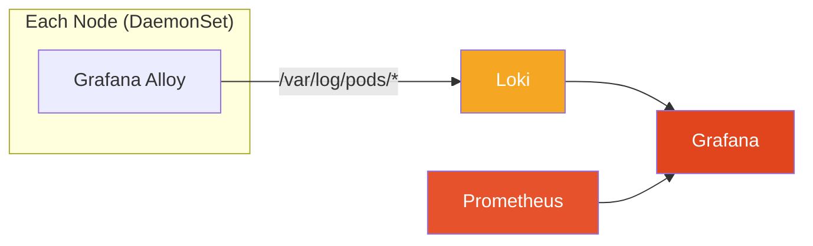

# Logging Stack: Grafana Loki + Grafana Alloy

This document explains the logging architecture used in this project, why these tools were
chosen, and how to use them.

---

## Why Loki over ELK/EFK

Traditional log stacks (Elasticsearch + Logstash/Fluentd + Kibana) index the full content
of every log line. This is powerful for full-text search but has significant costs:

| Aspect | Loki | Elasticsearch |
| --- | --- | --- |
| Index storage | Labels only (metadata) | Full log content |
| Storage cost | 10-50x cheaper for same volume | Expensive at scale |
| Query model | Label-based filtering + line grep | Full-text search |
| Grafana integration | Native datasource, same UI as Prometheus | Requires separate Kibana |
| Operational complexity | One binary, no index management | Index shards, replicas, ILM policies |

**When to use Loki:** You need "show me all ERROR logs from order-service in the last hour"
or "give me the log lines around the time this metric spiked." Loki answers these queries
in seconds with minimal storage.

**When to use OpenSearch/Elasticsearch instead:** You need full-text search across log
content — for example, "find all logs that contain the customer ID 12345" across all
services and all time. Loki can grep log lines but does not maintain a full-text index,
so this is slower at scale.

In this project we chose Loki because:
- Logs are already labeled with the same `namespace`, `pod`, `app` labels that Prometheus uses
- Grafana is already installed — Loki integrates as a native datasource with no extra UI
- Dev clusters have limited storage; Loki's filesystem mode uses a fraction of what Elasticsearch would

---

## Why Alloy over Promtail

**Promtail reached End of Life on March 2, 2026.** Grafana officially ended all support
and will not release further updates or security patches. Running Promtail in production
after this date means running unsupported, potentially vulnerable software.

**Grafana Alloy** is the official successor. Key differences:

| Feature | Promtail (EOL) | Grafana Alloy |
| --- | --- | --- |
| Status | End of Life — March 2, 2026 | Active development |
| Foundation | Purpose-built for Loki | OpenTelemetry Collector core |
| Signals | Logs only | Logs + Metrics + Traces + Profiles |
| Replaces | Promtail | Promtail + Grafana Agent + OTel Collector |
| DaemonSets needed | 1 per signal type | 1 total |

**One DaemonSet instead of many:** With Alloy, you deploy a single DaemonSet that handles
all observability signals. Previously you might run Promtail for logs, Grafana Agent for
metrics forwarding, and an OTel Collector sidecar for traces — three DaemonSets consuming
resources on every node. Alloy consolidates this into one binary.

**Built on OpenTelemetry:** Alloy's pipeline model (discover → relabel → collect → forward)
uses OTel Collector semantics, which means Alloy can forward to any OTel-compatible backend,
not just Grafana Cloud. This avoids vendor lock-in.

---

## Architecture



**Data flow:**

1. Alloy DaemonSet runs on every node — one pod per node, reads `/var/log/pods/`
2. Alloy queries the Kubernetes API to discover pods and attach metadata labels
3. Log lines are tagged with `namespace`, `pod`, `container`, `app` labels
4. Logs are pushed to Loki over HTTP (`/loki/api/v1/push`)
5. Loki stores log chunks and an index of labels
6. Grafana queries Loki using LogQL; Loki is configured as a datasource automatically
   via the `grafana-loki-datasource` ConfigMap in this directory

---

## LogQL Query Examples

LogQL is Loki's query language. It works in two modes:
- **Log queries** — return matching log lines
- **Metric queries** — return a time-series computed from log lines (e.g., error rate)

### Basic filtering

```logql
# All logs from order-service in the dev namespace
{namespace="kube-demo-dev", app="order-service"}

# All logs from any service in the dev namespace
{namespace="kube-demo-dev"}

# Logs from a specific pod
{namespace="kube-demo-dev", pod="order-service-7d9f8b-xkzp2"}
```

### Line filtering

```logql
# Only lines containing "ERROR"
{namespace="kube-demo-dev", app="order-service"} |= "ERROR"

# Exclude health check noise
{namespace="kube-demo-dev", app="api-gateway"} != "/health"

# Regex match
{namespace="kube-demo-dev"} |~ "timeout|connection refused"
```

### JSON log parsing

Services in this project emit structured JSON logs. Use the `json` parser to filter
by log fields:

```logql
# Parse JSON and filter by level field
{namespace="kube-demo-dev"} | json | level="error"

# Filter by multiple fields
{namespace="kube-demo-dev", app="order-service"} | json | level="error" | status_code >= 500
```

### Metric queries (for dashboards and alerts)

```logql
# Error rate per service — lines per second
sum by (app) (rate({namespace="kube-demo-dev"} |= "ERROR" [5m]))

# Total log volume per namespace
sum by (namespace) (rate({job=~".+"}[5m]))

# 95th percentile request duration (if services log request_duration_ms)
quantile_over_time(0.95, {namespace="kube-demo-dev", app="order-service"}
  | json
  | unwrap request_duration_ms [5m]) by (app)
```

---

## Accessing Logs in Grafana Explore

### Port-forward Grafana (dev/staging without Ingress)

```bash
kubectl port-forward svc/monitoring-grafana 3000:80 -n kube-monitoring
```

Then open http://localhost:3000 in your browser.
Default credentials: `admin` / `CHANGEME` (set in the monitoring ArgoCD Application).

### Using the Explore tab

1. In Grafana, click the compass icon in the left sidebar → **Explore**
2. In the top-left dropdown, select **Loki** as the datasource
3. Use the **Label filters** UI to pick `namespace`, `app`, etc., or switch to
   **Code** mode to type raw LogQL
4. Set the time range in the top-right (e.g., Last 1 hour)
5. Click **Run query**

Log lines appear in reverse chronological order. Click any line to expand it and see
all parsed labels and the full log content.

---

## Correlating Metrics and Logs

Prometheus and Loki use the **same label set**: `namespace`, `pod`, `app`, `container`.
This is intentional — Alloy maps Kubernetes metadata to Loki labels using the same naming
conventions that kube-state-metrics and node-exporter use for Prometheus.

**Practical workflow:**

1. A Prometheus alert fires: `HighErrorRate` for `app="order-service"` in `namespace="kube-demo-prod"`
2. Open Grafana → Explore → switch to Loki
3. Query: `{namespace="kube-demo-prod", app="order-service"} |= "ERROR"`
4. The error logs appear for the exact time window of the metric spike
5. No label translation needed — the same `app` and `namespace` values work in both systems

**Derived fields (TraceID linking):** If your services emit a `trace_id` field in JSON logs,
the `grafana-loki-datasource` ConfigMap configures a derived field that turns trace IDs
into clickable links. You can connect these to a Tempo or Jaeger datasource to jump from
a log line directly to the distributed trace.

---

## Files in This Directory

| File | Purpose |
| --- | --- |
| `grafana-loki-datasource.yaml` | ConfigMap that auto-registers Loki as a Grafana datasource |
| `prometheusrule.yaml` | Prometheus alert rules for application metrics |
| `README.md` | Prometheus/Grafana monitoring documentation |
| `logging-README.md` | This file — Loki + Alloy logging documentation |

ArgoCD Applications for Loki and Alloy:

| Environment | Loki | Alloy |
| --- | --- | --- |
| dev | `argocd/applications/dev/loki.yaml` | `argocd/applications/dev/alloy.yaml` |
| staging | `argocd/applications/staging/loki.yaml` | `argocd/applications/staging/alloy.yaml` |
| prod | `argocd/applications/prod/loki.yaml` | `argocd/applications/prod/alloy.yaml` |
