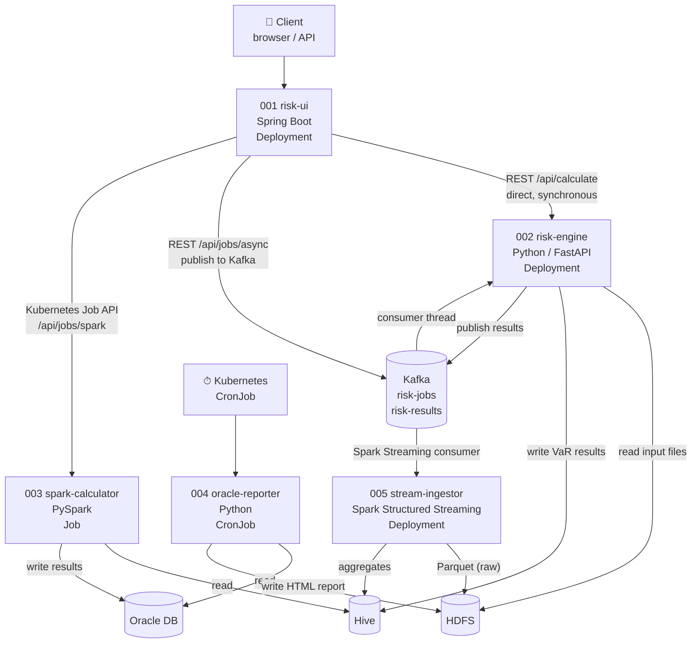
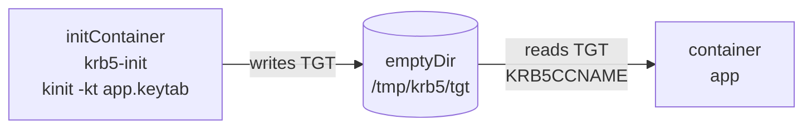
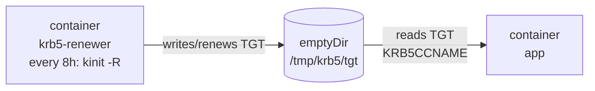

# hadoop-demo

Demonstrates patterns for building Python and Java applications that integrate
with an enterprise Hadoop ecosystem (HDFS, Hive, Spark, YARN) and Oracle DB,
deployed on Kubernetes with Kerberos authentication.

**Branch:** `hadoop` | **Related:** [`main` branch](../../tree/main) — generic Python microservices on Kubernetes

---

## Architecture



---

## Services

| # | Service | Workload | Stack | Build backend |
|---|---------|----------|-------|---------------|
| 001 | [risk-ui](001_risk-ui/) | Deployment | Spring Boot 3, Kubernetes Java client, Spring Kafka | Maven |
| 002 | [risk-engine](002_risk-engine/) | Deployment | Python, FastAPI, hdfs3, PyHive, kafka-python | poetry |
| 003 | [spark-calculator](003_spark-calculator/) | Job (on demand) | Python, PySpark | setuptools |
| 004 | [oracle-reporter](004_oracle-reporter/) | CronJob | Python, python-oracledb | requirements.txt |
| 005 | [stream-ingestor](005_stream-ingestor/) | Deployment | Python, PySpark Structured Streaming | setuptools |

---

## Kafka integration

Two services communicate via Kafka to decouple the trigger from the computation:

| Topic | Producer | Consumer | Purpose |
|-------|----------|----------|---------|
| `risk-jobs` | risk-ui (`POST /api/jobs/async`) | risk-engine (daemon thread) | Async VaR job dispatch |
| `risk-results` | risk-engine (after each calculation) | stream-ingestor (Spark Streaming) | Feed aggregation pipeline |

**Why Kafka alongside REST?**

- `POST /api/calculate` — synchronous REST, caller waits for the result (small portfolios, interactive)
- `POST /api/jobs/async` — fire-and-forget via Kafka, risk-engine processes at its own pace (large batches, event-driven)
- Kafka also decouples risk-engine from stream-ingestor: the aggregation pipeline can lag behind without affecting calculations

---

## Kerberos authentication patterns

Two patterns are shown depending on workload lifetime:

### Init container — for short-lived Jobs and CronJobs



Used by spark-calculator, oracle-reporter, and stream-ingestor.
The ticket lives long enough for one job run (~10 hours default lifetime).

Note: stream-ingestor is a long-running Deployment but uses the init container pattern,
because it reconnects to Kafka (not HDFS/Hive) most of the time — Kerberos is only
needed when writing micro-batch results. For workloads that hold an open HDFS/Hive
connection continuously, prefer the sidecar pattern (see risk-engine).

### Sidecar — for long-running Deployments with continuous Hadoop connections



Used by risk-engine. Ticket is renewed continuously without restarting the main container.
The renewer runs `kinit -R` (ticket renewal) every 8 hours, or a full `kinit` from the keytab
if the ticket's renewable lifetime has expired.

---

## Hadoop configuration as ConfigMap

Hadoop XML config files (`core-site.xml`, `hdfs-site.xml`, `hive-site.xml`) are mounted
from a ConfigMap as files — the same pattern as `handlers_config.yaml` in the `main` branch.

```text
ConfigMap: hadoop-config
  ├── core-site.xml  → /etc/hadoop/core-site.xml   (subPath mount)
  ├── hdfs-site.xml  → /etc/hadoop/hdfs-site.xml   (subPath mount)
  └── hive-site.xml  → /etc/hive/conf/hive-site.xml (subPath mount)
```

Updating cluster endpoints or Kerberos realm settings requires only `helm upgrade` — no image rebuild.
See [006_gitops/manifests/hadoop-config/](006_gitops/manifests/hadoop-config/).

---

## Spark deployment modes

`003_spark-calculator` demonstrates three ways to run Spark on Kubernetes.
The mode is selected via the `SPARK_MODE` environment variable, set per environment
in the Helm values file (`values-spark-submit.yaml` / `values-spark-operator.yaml` / `values-spark-yarn.yaml`):

| Mode | `SPARK_MODE` | How it works | Best for |
|------|--------------|--------------|----------|
| In-pod submit | `submit` | `spark-submit --master local[*]` inside the Job container | Dev, small datasets |
| Spark Operator | `operator` | `SparkApplication` CRD — operator manages driver + executors | Production on K8s |
| External YARN | `yarn` | `spark-submit --master yarn` — K8s Job submits to Hadoop YARN | Migration from YARN clusters |

`005_stream-ingestor` runs PySpark Structured Streaming in `local[*]` mode inside the Deployment pod.
The Kafka connector jar is bundled in the Docker image.

---

## Database migrations

| Service | Target | Tool | Pattern |
|---------|--------|------|---------|
| [002_risk-engine](002_risk-engine/) | Hive | beeline + HiveQL scripts | ArgoCD PreSync Job, forward-only |
| [005_stream-ingestor](005_stream-ingestor/) | Hive | beeline + HiveQL scripts | ArgoCD PreSync Job, forward-only |
| [004_oracle-reporter](004_oracle-reporter/) | Oracle | Alembic + python-oracledb | ArgoCD PreSync Job, with downgrade |

Hive migrations are forward-only — there are no rollback scripts.
Unlike PostgreSQL, Hive DDL has no transaction support, so rollback means
applying a new migration that reverses the change.

---

## When to use which workload

| Workload | Used by | Reason |
|----------|---------|--------|
| `Deployment` | risk-ui, risk-engine, stream-ingestor | Long-running stateless service, needs restarts/rolling updates |
| `Job` (on demand) | spark-calculator | One-shot computation launched by risk-ui via Kubernetes API |
| `CronJob` | oracle-reporter | Scheduled batch processing, no persistent HTTP server |

---

## Observability

All services expose Prometheus metrics and emit structured JSON logs to stdout.

| Service | Metrics endpoint | Key metrics |
|---------|-----------------|-------------|
| risk-ui | `/actuator/prometheus` | `riskui_kafka_jobs_total`, `riskui_calculate_requests_total` |
| risk-engine | `/metrics` | `risk_engine_calculations_total`, `risk_engine_calculation_duration_seconds`, `risk_engine_kafka_consumer_lag` |
| stream-ingestor | `:9090/metrics` | `stream_ingestor_records_processed_total`, `stream_ingestor_batch_duration_seconds` |

Logs are collected by **Alloy** (DaemonSet) and stored in **Loki**. Grafana provides
a pre-built dashboard ("Hadoop Demo — Overview") and is deployed via the GitOps monitoring stack.

See [006_gitops/manifests/monitoring/](006_gitops/manifests/monitoring/) for Helm values,
PrometheusRule alerts, and the Grafana dashboard ConfigMap.

---

## GitOps and secret management

Kubernetes deployments are managed by **ArgoCD** via the [006_gitops/](006_gitops/) directory:

- **Helm charts** for all five services under `006_gitops/helm/`
- **ArgoCD Applications** per environment (dev / staging / prod) under `006_gitops/argocd/`
- **Raw manifests** for RBAC, Hadoop config, monitoring, and Kerberos under `006_gitops/manifests/`

Secrets (keytabs, Oracle password) are never stored in Git.
**HashiCorp Vault + External Secrets Operator** sync them into Kubernetes Secrets
across all environments automatically.
See [006_gitops/manifests/vault/](006_gitops/manifests/vault/) for manifests and setup guide.

---

## Quick start (local with mocks)

Mock mode replaces all Hadoop/Oracle/Kafka connections with in-process stubs.
Set `MOCK_MODE=true` (default in `.env.example`) to run without any infrastructure.

```bash
# Copy env files
for svc in 001_risk-ui 002_risk-engine 003_spark-calculator 004_oracle-reporter 005_stream-ingestor; do
    cp $svc/.env.example $svc/.env
done

# Start core long-running services (risk-ui, risk-engine, Kafka)
make up

# Run tests for all Python services + Maven tests for risk-ui
make test

# Lint Python code and Dockerfiles
make lint && make lint-docker

# Run spark-calculator as a one-off container (simulates K8s Job)
make spark-job

# Run oracle-reporter manually (simulates CronJob trigger)
make report

# Start stream-ingestor (runs a single mock micro-batch then stays alive)
docker compose --profile streaming up stream-ingestor

# Stop all services
make down
```

### Service URLs (local)

| Service | URL | Notes |
|---------|-----|-------|
| risk-ui | <http://localhost:8080> | Swagger UI at `/swagger-ui.html` |
| risk-engine | <http://localhost:8081/docs> | FastAPI auto-docs |
| stream-ingestor | <http://localhost:9090/metrics> | Prometheus metrics only |
| spark-calculator | — | Job, launched via `make spark-job` |
| oracle-reporter | — | CronJob, launched via `make report` |
| Kafka | `localhost:9092` | KRaft mode (no Zookeeper) |
