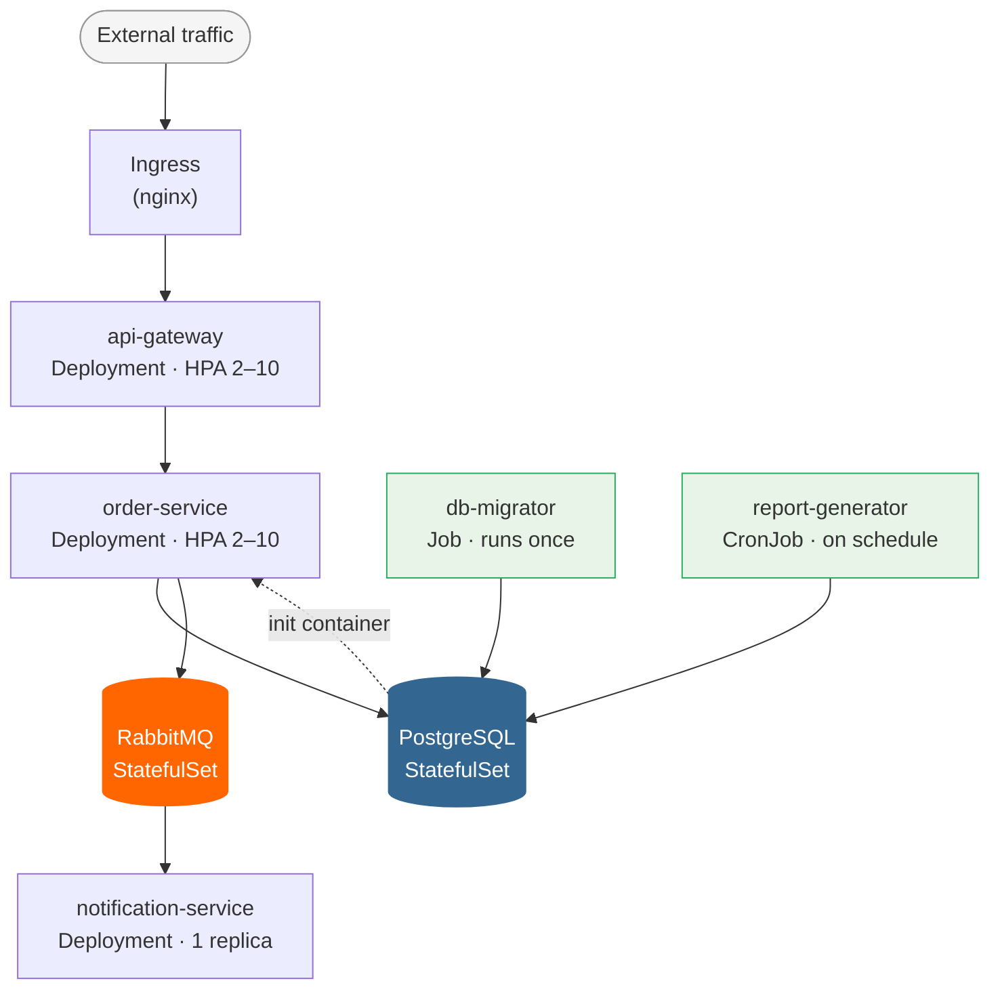

# kube-demo

A demonstration project for developers and DevOps engineers showing standards and patterns
for deploying Python applications to Kubernetes.

## Repository structure note

In a real project each directory is a **separate git repository**:

| Directory | Repository | Type |
| --- | --- | --- |
| [001_api-gateway/](001_api-gateway/) | `git@github.com:ashokhin/api-gateway.git` | Application |
| [002_order-service/](002_order-service/) | `git@github.com:ashokhin/order-service.git` | Application |
| [003_notification-service/](003_notification-service/) | `git@github.com:ashokhin/notification-service.git` | Application |
| [004_db-migrator/](004_db-migrator/) | `git@github.com:ashokhin/db-migrator.git` | Application |
| [005_report-generator/](005_report-generator/) | `git@github.com:ashokhin/report-generator.git` | Application |
| [006_gitops/](006_gitops/) | `git@github.com:ashokhin/gitops.git` | GitOps (Helm + ArgoCD) |

They are combined into a single monorepo here for demonstration convenience only.

Directories are numbered so they sort naturally in the filesystem and reflect the logical
order in which services are deployed (lower number = deployed earlier).

---

## Architecture



## Services

### Long-running services (Deployment)

- **[001_api-gateway](001_api-gateway/)** — single HTTP entry point, routes requests to internal services
- **[002_order-service](002_order-service/)** — order business logic, writes to PostgreSQL and publishes to RabbitMQ
- **[003_notification-service](003_notification-service/)** — consumes events from RabbitMQ, dispatches notifications

### Stateful infrastructure (StatefulSet)

- **PostgreSQL** — primary database (`bitnami/postgresql` Helm chart)
- **RabbitMQ** — message broker (`bitnami/rabbitmq` Helm chart)

### One-shot tasks

- **[004_db-migrator](004_db-migrator/)** — `Job`: applies Alembic migrations before deploy
- **[005_report-generator](005_report-generator/)** — `CronJob`: generates order summary report on schedule

## When to use which Kubernetes workload

| Workload | Use when | Example |
| --- | --- | --- |
| `Deployment` | Stateless service, any number of identical replicas | api-gateway, order-service |
| `StatefulSet` | Stateful storage, stable network identities, ordered start/stop | PostgreSQL, RabbitMQ |
| `Job` | Task must run exactly once and complete successfully | db-migrator |
| `CronJob` | Task must repeat on a schedule (cron syntax) | report-generator |

## Supporting Kubernetes objects

### Ingress

Ingress is not a workload — it is a routing rule. A single Ingress controller (e.g. nginx)
runs in the cluster and acts as a reverse proxy for all services. Each Ingress object defines
which hostnames and URL paths should be forwarded to which Service.

```text
Client → cloud LB → nginx Ingress controller → Service (ClusterIP) → Pod
```

Without Ingress you would need one cloud LoadBalancer per service (expensive).
With Ingress you need one LoadBalancer for the entire cluster.

In this project only `api-gateway` has an Ingress. Internal services communicate
directly via ClusterIP Service names (e.g. `http://kube-demo-order-service:80`).

See the annotated manifest: [006_gitops/manifests/api-gateway/ingress.yaml](006_gitops/manifests/api-gateway/ingress.yaml)

### HorizontalPodAutoscaler (HPA)

HPA automatically adjusts the number of pod replicas in a Deployment based on metrics
(CPU, memory, or custom). It is a separate object that watches the Deployment and updates
`spec.replicas` on its behalf.

```text
HPA watches Pod metrics (via metrics-server)
  → average CPU across all pods > 70%  → scale up   (add replicas)
  → average CPU across all pods < 70%  → scale down (remove replicas, after cooldown)
```

Key rules:

- **Never set `replicas:` in the Deployment when HPA is enabled** — they will fight each
  other on every `kubectl apply`. The Helm template omits `replicas` automatically when
  `autoscaling.enabled=true`.
- HPA respects `minReplicas` and `maxReplicas` bounds at all times.
- HPA requires `resources.requests.cpu` to be set on the container — without it there
  is no baseline to calculate utilization percentage against.

In this project `api-gateway` and `order-service` have HPA (stateless, CPU-bound traffic).
`notification-service` does not — scaling consumers requires partitioned queues.

See the annotated manifest: [006_gitops/manifests/api-gateway/hpa.yaml](006_gitops/manifests/api-gateway/hpa.yaml)

## Application standards

Every service in this project follows the same set of conventions.
This section explains what each convention is, why it exists, and where to find it in the code.

### Structured logging (JSON)

All services write logs to stdout as newline-delimited JSON.

```text
{"time":"2024-01-01 12:00:00,000","level":"INFO","name":"src.main","message":"order created","order_id":"abc-123"}
```

**Why JSON?** Log collectors (Fluentd, Promtail, Vector) read container stdout and forward
logs to a central store (Elasticsearch, Loki). JSON lets them parse fields without fragile
regex patterns. The `order_id` field above becomes a filterable index key automatically.

**Why stdout?** The [12-factor app](https://12factor.net/) *(external)* rule: a process
should not concern itself with routing or storage of its output. Kubernetes captures stdout
and stderr per container; the log pipeline is configured separately.

Configuration is done once at module level with `logging.config.dictConfig` and a JSON
formatter. All subsequent `logger.info(...)` calls across the codebase inherit it.

See: [001_api-gateway/src/main.py](001_api-gateway/src/main.py)

### Prometheus metrics (`/metrics`)

Every service exposes a `/metrics` HTTP endpoint in the Prometheus text format.
Prometheus scrapes it on a schedule; Grafana reads from Prometheus to draw dashboards.

**Two metric types used in this project:**

| Type | When to use | Example |
| --- | --- | --- |
| `Counter` | Value only ever increases (events, errors, requests) | `orders_created_total` |
| `Histogram` | Distribution of values (duration, size) | `processing_duration_seconds` |

Counters are summed or `rate()`-ed in PromQL (`rate(orders_created_total[5m])`).
Histograms give percentiles (`histogram_quantile(0.99, ...)`).
Do not use a Gauge for things that only go up — use a Counter.

**Naming convention:** `<service_name>_<what>_<unit>` — e.g.
`api_gateway_requests_total`, `notification_service_processing_duration_seconds`.

#### Labels

Labels split one metric into multiple time series — one per unique label combination.
They are defined at metric creation time and set when the metric is recorded:

```python
# Definition: declare which label dimensions this metric has
REQUEST_COUNT = Counter(
    "api_gateway_requests_total",
    "Total number of requests received",
    ["method", "path", "status_code"],   # label names
)

# Usage: provide a value for each label when incrementing
REQUEST_COUNT.labels(method="POST", path="/orders", status_code=201).inc()
REQUEST_COUNT.labels(method="GET",  path="/orders/abc", status_code=404).inc()
```

This produces separate time series in Prometheus:

```text
api_gateway_requests_total{method="POST", path="/orders",     status_code="201"} 142
api_gateway_requests_total{method="GET",  path="/orders/abc", status_code="404"} 7
api_gateway_requests_total{method="GET",  path="/orders/abc", status_code="200"} 891
```

Labels make it possible to ask specific questions in PromQL:

```promql
# Request rate broken down by status code (spot error spikes)
rate(api_gateway_requests_total[5m])

# Error rate only (4xx + 5xx)
rate(api_gateway_requests_total{status_code=~"4..|5.."}[5m])

# p99 latency for POST /orders only
histogram_quantile(0.99,
  rate(api_gateway_request_duration_seconds_bucket{method="POST", path="/orders"}[5m])
)

# notification-service: processed vs received per event type (detect backlog)
rate(notification_service_messages_processed_total{event_type="order.created"}[5m])
/
rate(notification_service_messages_received_total{event_type="order.created"}[5m])
```

**Label cardinality warning:** every unique label value combination creates a new time series.
Never use high-cardinality values as labels — user IDs, order IDs, UUIDs will create
millions of series and crash Prometheus. Use only low-cardinality values: HTTP methods,
status codes, event types, service names.

In Kubernetes, Prometheus discovers services via the `ServiceMonitor` CRD
(Prometheus Operator). The ServiceMonitor tells Prometheus which port and path to scrape.

See: [001_api-gateway/src/metrics.py](001_api-gateway/src/metrics.py),
[006_gitops/manifests/api-gateway/servicemonitor.yaml](006_gitops/manifests/api-gateway/servicemonitor.yaml)

### Liveness and readiness probes

Kubernetes uses HTTP probes to decide whether a pod is healthy and whether it should receive traffic.
Every service exposes two endpoints for this purpose.

#### `/healthz` — liveness probe

```python
@app.get("/healthz")
async def healthz():
    return {"status": "ok"}
```

**Question it answers:** Is the process still alive and not deadlocked?

Kubernetes calls this endpoint periodically. If it fails `failureThreshold` times in a row,
Kubernetes **kills and restarts the pod** (`restartPolicy`). The check must be fast and
must never require external dependencies — if the database is down, the process is still
alive and should not be killed.

#### `/readyz` — readiness probe

```python
@app.get("/readyz")
async def readyz():
    db_ok = await check_db_connection()
    mq_ok = await check_mq_connection()
    if not db_ok or not mq_ok:
        raise HTTPException(status_code=503)
    return {"status": "ok"}
```

**Question it answers:** Is the pod ready to serve requests right now?

If this returns non-200, Kubernetes **removes the pod from the Service endpoints** — no
new traffic is routed to it. The pod is not restarted. This is used in two scenarios:

1. **Startup**: the pod is booting and its dependencies (DB, message broker) are not yet
   reachable. Kubernetes waits until `/readyz` passes before sending traffic.
2. **Runtime degradation**: the DB becomes temporarily unreachable. Traffic is drained to
   healthy pods automatically. When the DB recovers, `/readyz` passes again and the pod is
   re-added to the load balancer.

#### Probe configuration in Kubernetes

```yaml
livenessProbe:
  httpGet:
    path: /healthz
    port: 8080
  initialDelaySeconds: 10    # wait before first check (give the process time to start)
  periodSeconds: 10

readinessProbe:
  httpGet:
    path: /readyz
    port: 8080
  initialDelaySeconds: 5
  periodSeconds: 5
```

See the annotated manifests:
[006_gitops/manifests/api-gateway/deployment.yaml](006_gitops/manifests/api-gateway/deployment.yaml)

### Graceful shutdown

When Kubernetes wants to stop a pod (scale-down, rolling update, node drain), it:

1. Sends `SIGTERM` to the process
2. Waits `terminationGracePeriodSeconds` (default 30s)
3. Sends `SIGKILL` if the process is still running

Proper handling: finish in-flight requests, close connections, stop consuming messages.
Without it, a Kubernetes rolling update causes request errors and message loss.

FastAPI + uvicorn handle `SIGTERM` automatically (finish current HTTP requests, then exit).
The RabbitMQ consumer (`notification-service`) uses an `asyncio.Event` flag so it stops
after the current message completes, not mid-processing.

See: [003_notification-service/src/consumer.py](003_notification-service/src/consumer.py),
[003_notification-service/src/main.py](003_notification-service/src/main.py)

---

## What this project demonstrates

### For developers

- [12-factor app](https://12factor.net/) *(external)* structure ready for Kubernetes
- Configuration via environment variables (ConfigMap, Secret)
- Graceful shutdown
- Prometheus metrics (`/metrics` endpoint)
- Structured logging (JSON)
- Liveness and readiness probes (`/healthz`, `/readyz`)

### For DevOps engineers

- Multi-stage Dockerfile with non-root user
- **Helm** — parametrized charts with per-environment values files (dev/staging/prod)
- **ArgoCD** — GitOps controller: cluster state driven by git, not by manual `kubectl`
- ConfigMap vs Secret: difference and mounting strategies
- Resource requests and limits
- HorizontalPodAutoscaler
- Ingress with TLS
- ServiceMonitor for Prometheus Operator
- Jenkins CI pipeline: lint → test → build → push → promote (Jenkinsfile in each service)

See [006_gitops/README.md](006_gitops/README.md) for explanations of Helm and ArgoCD,
environment differences, and the full CI/CD promote flow.

## Quick Start

### Run locally (Docker Compose)

```bash
git clone https://github.com/ashokhin/kube-demo.git && cd kube-demo
docker compose up -d                                             # start infra + all services
docker compose --profile migration run --rm db-migrator          # apply DB migrations
docker compose --profile reports run --rm report-generator       # generate order report
docker compose down                                              # stop everything
```

### Services after `docker compose up`

| Service | URL | Notes |
| --- | --- | --- |
| api-gateway | <http://localhost:8080> | main HTTP entry point |
| order-service | <http://localhost:8081> | direct access (for debugging) |
| RabbitMQ management | <http://localhost:15672> | user: `orders_user` / pass: `CHANGEME` |

Health and metrics endpoints are available on each service:
`/healthz`, `/readyz`, `/metrics`.

### Deploy to Kubernetes

See [006_gitops/README.md](006_gitops/README.md) for full GitOps deployment with Helm and ArgoCD.
